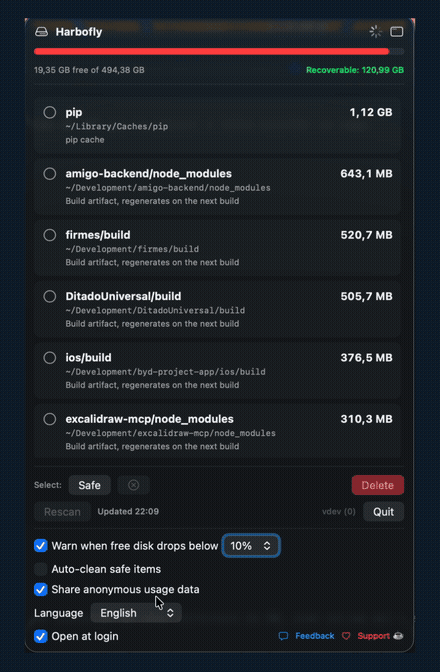
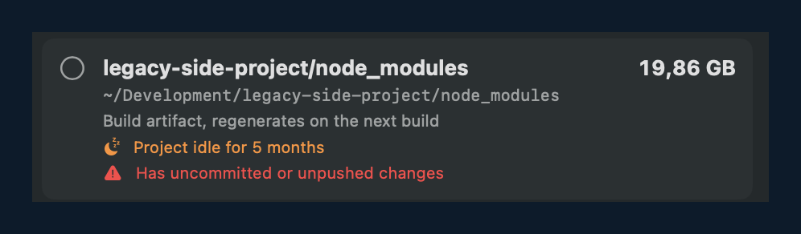

# Harbofly

[](https://github.com/jaywcjlove/awesome-mac)

🇧🇷 Português · [🇺🇸 English](README.md)

> **A limpeza de disco feita pra quem programa.** Recupere 20-100 GB de node_modules, Docker, Gradle, Xcode e caches de build, com segurança. → [harbofly.app](https://harbofly.app)

App de barra de menu pro macOS que **descobre sozinho** o que está ocupando seu disco e deixa você limpar com um clique, sem configurar path nenhum.

Nasceu de uma dor real: um Mac de dev iOS/Android acumula dezenas de GB em build artifacts e caches (`build/`, `.build/`, `node_modules/`, `DerivedData`, caches de SPM/Homebrew/Yarn/pip…) que ninguém lembra de limpar. O Harbofly varre esses lugares automaticamente, mostra quanto dá pra recuperar e organiza por nível de risco, e, por padrão, **manda tudo pra Lixeira** (dá pra restaurar).

Grátis · Open source · Notarizado pela Apple · Foco em privacidade (analytics anônimo, opt-in).

<p align="center">
  
</p>
<p align="center">
  <sub>▶ Demo completo em <a href="https://harbofly.app">harbofly.app</a></sub>
</p>

<p align="center">
  
</p>
<p align="center">
  <sub>Ele sabe quais projetos você abandonou — e avisa se ainda têm trabalho não pushado.</sub>
</p>

## Featured

Listado no **[Awesome Mac](https://github.com/jaywcjlove/awesome-mac)**, o diretório curado dos melhores apps de macOS, e compartilhado pelo mantenedor [@jaywcjlove](https://twitter.com/jaywcjlove). Descrito por lá como *"um app de barra de menu que descobre sozinho e libera o espaço que artefatos e caches de build de dev ocupam."*

## Instalação

```bash
brew install --cask carloshpdoc/tap/harbofly
```

Ou baixe o `.dmg` notarizado em **[harbofly.app](https://harbofly.app)**.

## CLI

O binário do app também é um CLI — a instalação via Homebrew expõe o comando `harbofly`:

```bash
harbofly scan                # lista caches/artifacts com tamanho e tier de risco
harbofly scan --json         # saída pra máquina
harbofly clean --dry-run     # prévia do que a limpeza segura mandaria pra Lixeira
harbofly clean               # manda todos os itens 🟢 seguros pra Lixeira
harbofly clean --stale-only  # só artifacts de projetos parados há 90+ dias
```

O CLI só toca no tier 🟢 seguro e sempre passa pela Lixeira.
Instalou pelo DMG? Rode `/Applications/Harbofly.app/Contents/MacOS/Harbofly scan`.

## Features

- **Auto-discovery**: varre `~/Development` procurando `build`, `.build`, `node_modules`, `Pods`, mais 25+ locais de cache conhecidos — package managers (npm, pnpm, Bun, Gradle, Maven, Cargo, Go, Flutter, pip, uv, CocoaPods, Homebrew…), editores (VS Code, Cursor, JetBrains) e **ferramentas de IA** (pesos de modelo do Ollama, Hugging Face, LM Studio). Zero config de path.
- **DerivedData por projeto**: a pasta de build de cada projeto Xcode aparece separada, resolvida pro workspace dono.
- **Detecção de projetos parados**: projeto sem atividade há 90+ dias ganha selo — e alerta vermelho se tiver **trabalho não commitado ou não pushado** (lido do git local, 100% offline).
- **Auto-clean (opt-in, grátis)**: deixa o Harbofly fazer a faxina sozinho — **no fim do dia**, no começo do dia, ao fechar o Xcode, toda semana ou com disco baixo. Você escolhe o escopo (caches de ferramentas → projetos parados → tudo 🟢) e o mínimo. Só itens 🟢 seguros, sempre pela Lixeira, com notificação e histórico. Depois de algumas limpezas manuais, ele oferece assumir isso num toque. A automação que outros limpadores trancam num plano **Pro** pago — aqui é de graça.
- **Simuladores, um ou vários**: apague simuladores indisponíveis em 1 clique, ou expanda o CoreSimulator numa lista por simulador — cada um com seu tamanho — e apague só os que você escolher (`simctl delete`, confirmação em dois passos). Também limpa os **XCTestDevices**, os clones descartáveis que os testes em paralelo / xcodebuildmcp acumulam.
- **Espaço purgeável do macOS, explicado**: mostra quanto os snapshots do Time Machine e caches de sistema ocupam — o clássico "apaguei 20 GB e o Finder não mostra".
- **6 idiomas**: Português, English, Español, Français, Deutsch, 中文 — com troca instantânea.
- **Feedback in-app**: bug ou ideia vai direto pro mantenedor, sem precisar de conta.
- **Barra de disco** no topo com cor por pressão: verde → laranja (<20%) → **vermelho (<10%)**.
- **"Recuperável: X GB"**: soma do que dá pra limpar agora.
- **Tiers de risco:**
  - 🟢 **Seguro**: regenera sozinho no próximo build.
  - 🟡 **Cuidado**: recria, mas custa (recompilar do zero, re-baixar símbolos de device).
  - 🔵 **Informativo**: pastas grandes que ele mostra só pra você saber onde o espaço está, mas **nunca apaga** (CoreSimulator, Application Support, Downloads).
- **Vai pra Lixeira por padrão**: dá pra restaurar. **Excluir de vez** existe, mas é opt-in e você confirma antes.
- **Cada item mostra** nome, caminho completo e o que é.
- **"Selecionar seguros"** marca o tier seguro inteiro de uma vez.
- **Notificação de disco baixo**: avisa quando o livre cai abaixo do limite que você escolher (5/10/15/20%).
- **Rescan automático** a cada 30 min + botão manual.
- **Auto-update** via [Sparkle](https://sparkle-project.org): avisa quando sai uma versão nova (dá pra desligar).

## Segurança

Como é uma ferramenta que apaga arquivo, ela foi feita pra ser confiável:

- **Padrão = Lixeira** (restaurável); nada perigoso vem pré-selecionado; confirmação antes de qualquer exclusão.
- **Open source de ponta a ponta**: dá pra auditar exatamente o que sai da sua máquina. O analytics é **opt-in e desligado por padrão** (via [TelemetryDeck](https://telemetrydeck.com)); quando ligado, envia só estatísticas de uso anônimas e agregadas (eventos, GB recuperados, categorias de cache) — nunca e-mail, IP, nome, caminhos ou nomes de projeto. Dá pra ligar/desligar quando quiser nas preferências.
- **Assinado com Developer ID + notarizado** pela Apple; **build provenance (SLSA)** em cada release, verificável com `gh attestation verify Harbofly.dmg --repo carloshpdoc/Harbofly`.

## O que ele varre

**`~/Development`** (auto-discovery, profundidade até 3):
`build`, `.build`, `node_modules`, `Pods`, `DerivedData`, tudo classificado como 🟢 Seguro.

**`~/Library`** (alvos conhecidos):

| Path | Tier | O que é |
|------|------|---------|
| `Developer/Xcode/DerivedData` | 🟢 | Intermediários de build do Xcode |
| `Developer/XcodeBuildMCP/workspaces` | 🟢 | Workspaces do XcodeBuildMCP |
| `Caches/org.swift.swiftpm` | 🟢 | Cache do Swift Package Manager |
| `Caches/Homebrew` | 🟢 | Downloads do Homebrew |
| `Caches/Yarn` | 🟢 | Cache do Yarn |
| `Caches/pip` | 🟢 | Cache do pip |
| `Developer/Xcode/iOS DeviceSupport` | 🟡 | Símbolos de devices (recria ao conectar iPhone) |
| `Caches/ms-playwright` | 🟡 | Browsers baixados pelo Playwright |
| `Caches/Google` | 🟡 | Cache do Google/Chrome |

**Informativo (só leitura, nunca apaga):** `Library/Developer/CoreSimulator`, `Library/Application Support`, `Downloads`.

Itens abaixo de 10 MB são ignorados pra reduzir ruído. Os alvos ficam em `scanDevelopment()`, `scanLibrary()` e `scanInfo()` no `Sources/Harbofly/App.swift`, fáceis de ajustar.

## Requisitos

- macOS 14+ (Sonoma)
- Apple Silicon
- Swift 6 (toolchain do Xcode)

## Build & Run

```bash
# Gera Harbofly.app assinado e mostra onde ficou
./make-app.sh

# Abre o app (ícone aparece na barra de menu)
open Harbofly.app
```

Para distribuir fora da Mac App Store (assina com Developer ID, notariza, "staple" e monta o `.dmg` estilizado):

```bash
# requer SIGN_ID, ASC_KEY_ID e ASC_ISSUER_ID no ambiente + a .p8 em ~/.appstoreconnect/private_keys/
./make-dmg.sh   # produz Harbofly.dmg pronto pra distribuir
```

Releases oficiais saem por **GitHub Actions** ao dar push numa tag `vX.Y.Z`: build + notarização + build provenance + `.dmg` + appcast do Sparkle + bump automático do cask no tap.

Durante o desenvolvimento:

```bash
xcrun swift build            # debug
xcrun swift run              # roda direto (sem .app; Sparkle fica inerte)
xcrun swift build -c release # release
```

## Versão

- SemVer user-facing no arquivo `VERSION` (fonte única).
- Build number monotônico = nº de commits (`git rev-list --count HEAD`).

## Estrutura

```
Harbofly/
├── Package.swift                 # SwiftPM (macOS 14+) + dependência do Sparkle
├── Sources/Harbofly/App.swift    # app inteiro: scanner + UI (nome de exibição em AppInfo.name)
├── Assets/                       # arte do ícone (HarboflyIcon.png) + Harbofly.icns
├── VERSION                       # SemVer user-facing
├── appcast.xml                   # feed de update do Sparkle (gerado no release)
├── make-app.sh                   # monta o Harbofly.app (embute + assina o Sparkle)
├── make-dmg.sh                   # assina (Developer ID) + notariza + monta o .dmg
├── make-icon.sh                  # gera o .icns a partir da arte
├── .github/workflows/release.yml # CI de release (tag v* → build/notariza/appcast/cask)
├── SETUP-SPARKLE.md              # como configurar as chaves do auto-update
└── README.md
```

## Auto-update (Sparkle)

O app checa um appcast assinado (EdDSA) e oferece a atualização. Fica **inerte** até as chaves serem configuradas, ver [`SETUP-SPARKLE.md`](SETUP-SPARKLE.md). Quem instala via Homebrew atualiza com `brew upgrade`.
